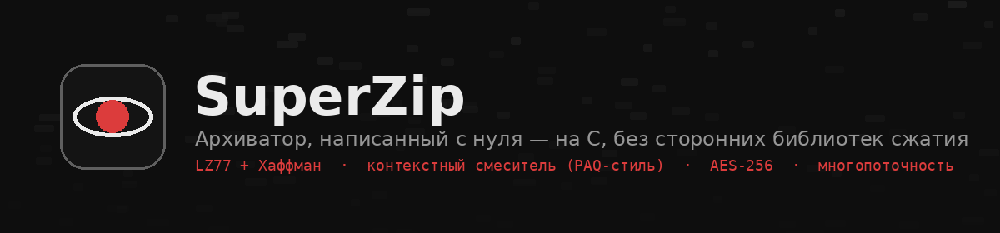
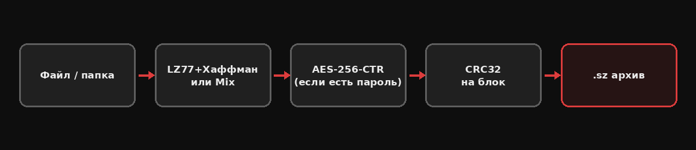
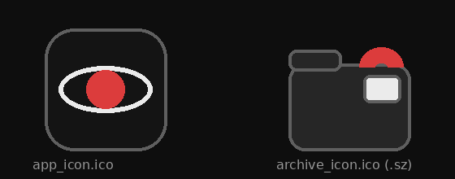

<p align="center">
  
</p>

<p align="center">
  
  
  
</p>

# SuperZip

Архиватор Windows, написанный **с нуля на C** — без zlib, без libzip, без сторонних
библиотек сжатия или криптографии (кроме встроенного в саму Windows `BCrypt`).
Учебный проект: пройден весь путь от простого LZ77 до контекстного смесителя
в стиле PAQ, потоковой обработки терабайт-файлов и AES-256.

<p align="center">
  
</p>

## Возможности

- **Два движка сжатия** — переключаются прямо в окне:
  - `LZ77 + Хаффман` — быстрый, классический подход (как gzip)
  - `Mix` — контекстный смеситель с несколькими моделями, моделью совпадений
    и SSE-коррекцией (мини-PAQ); жмёт сильнее, но медленнее
- **Файлы и папки** — папки упаковываются рекурсивно, с сохранением структуры
- **Потоковая обработка** — память не зависит от размера файла; работает
  с архивами от килобайта до террабайт без переполнения ОЗУ
- **Многопоточность** — блоки сжимаются параллельно, по числу ядер процессора
- **AES-256 (CTR) с паролем** — ключ через PBKDF2-SHA256 (200 000 итераций),
  всё через встроенный Windows `BCrypt`
- **CRC32 на каждый блок** — повреждённый архив не распакуется молча в мусор
- **Кнопка отмены** — для долгих операций на больших файлах
- **Drag-and-drop** — файл или папку можно перетащить прямо в окно
- **Интеграция с проводником** — пункт «Сжать в SuperZip» по правому клику
  на файле или папке, своя иконка у `.sz`-файлов, открытие по двойному клику
- **Установщик** — обычный `.exe`-инсталлятор (Inno Setup), как у привычных программ

<p align="center">
  
</p>

## Структура проекта

```
SuperZip/
├── superzip_gui.c          окно программы (Win32 API) — то, что запускает пользователь
├── sz.c                    движок LZ77 + Хаффман как отдельный CLI-инструмент
├── mix.c                   движок Mix (контекстный смеситель) как отдельный CLI-инструмент
├── superzip_app.html       дизайн-макет интерфейса (просто открыть в браузере)
├── docs/                   картинки для этого README
└── installer/
    ├── superzip_setup.iss  скрипт установщика (Inno Setup)
    └── assets/             иконки и баннер установщика
```

`sz.c` и `mix.c` — это самостоятельные движки сжатия, на которых всё
тестировалось с нуля; `superzip_gui.c` встраивает оба движка целиком в одно
Windows-приложение с настоящим окном.

## Сборка

Нужен компилятор C для Windows. Проще всего —
[w64devkit](https://github.com/skeeto/w64devkit) (просто распаковать архив,
никакой установки).

```bash
gcc -O2 -mwindows -o SuperZip.exe superzip_gui.c -lcomctl32 -lcomdlg32 -lshell32 -lole32 -lbcrypt
```

Отдельные движки (необязательно, для командной строки):

```bash
gcc -O2 -o sz.exe  sz.c
gcc -O2 -o mix.exe mix.c
```

## Установщик

1. Собери три `.exe` (см. выше) и положи их в папку `installer/`, рядом со
   скриптом — `superzip_setup.iss` ищет файлы по соседству.
2. Установите [Inno Setup](https://jrsoftware.org/isinfo.php) (бесплатно).
3. Открой `installer/superzip_setup.iss`, нажми **F9**.
4. Готовый установщик появится в `installer/Output/SuperZip-Setup.exe`.

## Использование

Запустите `SuperZip.exe` — откроется окно. Выбери файл или папку (через
«Обзор...» или перетащи прямо в окно), настрой уровень сжатия и метод,
по желанию укажи пароль — и нажми **Сжать** или **Распаковать**.

Через проводник: правый клик на файле/папке → **«Сжать в SuperZip»**;
двойной клик по `.sz`-файлу — распаковка.

## Формат архива

Собственный потоковый формат (`SZ05` / `SZE5` для зашифрованных) — данные
разбиваются на блоки по 16 МБ, каждый блок сжат и помечен CRC32 независимо
от остальных. Старые версии формата (`SZ02`–`SZ04`), сделанные более ранними
сборками, тоже читаются — внутри есть запас обратной совместимости.

## Известные ограничения

- На очень больших файлах (десятки ГБ и больше) сжатие может занимать заметное
  время — движки самописные, не оптимизированные на уровне zstd/7-Zip
- Блочная потоковая схема означает, что совпадения дальше границы одного
  блока (16 МБ) не находятся — небольшая потеря по сравнению со сжатием
  всего файла как одного целого
- Контекстное меню в Windows 11 иногда прячет сторонние пункты под
  «Показать больше параметров» — это поведение самой системы

## Лицензия

[MIT](LICENSE) — делай что хочешь, ссылка на автора приветствуется но не обязательна.
